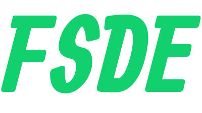

  

# Fastre SyncEngine Development Environment

FSDE is a development environment that includes Fastre and SyncEngine. It simplifies both frontend web development and backend data integration.

## Components

- **Fastre**: A runtime engine for web development using an HTML-like syntax.
- (NOT READY) **SyncEngine**: A runtime engine for data integration and API middleware, transforming various data formats into a unified API interface.

## Installation

1. Download the FSDE installer from the [releases page](https://github.com/mvishok/fsde/releases).
2. Run the installer and follow the instructions.

## Usage

- **Fastre**: `fsde install fastre` This will install Fastre and its dependencies.
- (NOT READY) **SyncEngine**: `syncengin <config-file>`

## Auto-update

Both Fastre and SyncEngine check for updates automatically when run.

## License

This project is licensed under the MIT License. See the [LICENSE](LICENSE) file for details.
